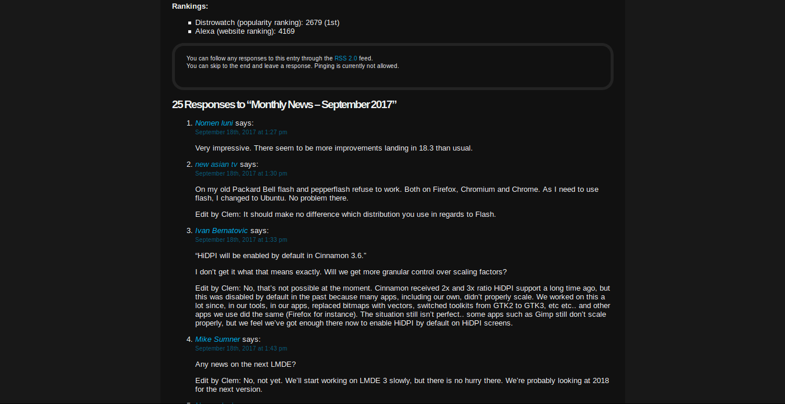
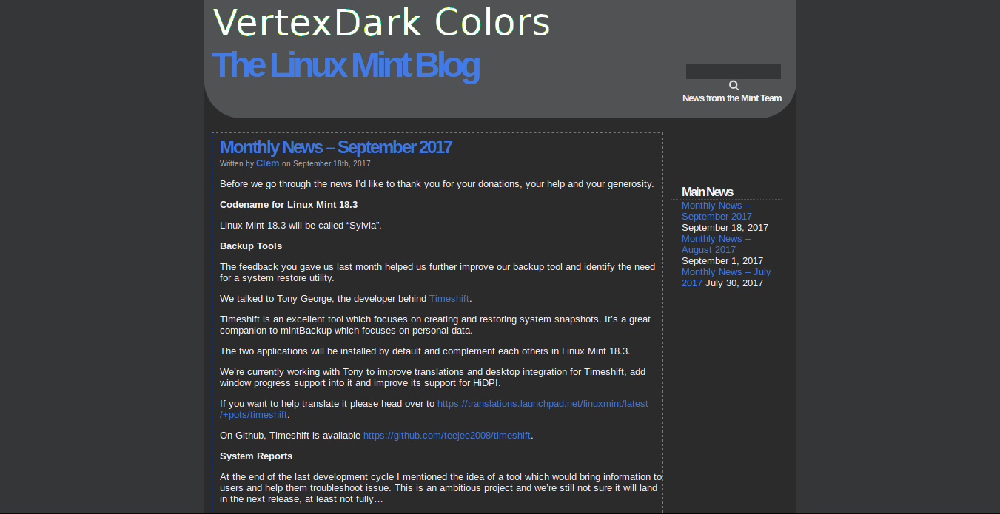

# LinuxMint_Blog-Deepdark

Follow minty news in the dark. May the dark be kinder on thine eyes. (linuxmint blog dark theme) 

This is a dark theme for http://blog.linuxmint.com/ inspired by [FT DeepDark](https://addons.mozilla.org/en-US/firefox/addon/ft-deepdark/?src=search).

Also, credit where credit is due for the color palettes down bellow. ([@KDE](https://github.com/KDE), [@horst3180](https://github.com/horst3180), [@linuxmint](https://github.com/linuxmint), [YouTube](https://www.youtube.com/) and [Discord](https://discordapp.com/))

Theme as userstyle [here](https://userstyles.org/styles/148370/linuxmint-blog-deepdark).

### **You can also install all my themes at once from [here](https://gitlab.com/RaitaroH/Import-All-Deepdark).**

# Screenshots
Main page

Search

Comments

Sponsors

# Colors
Colors are available in the code, at the top. Uncomment one of the provided colors.
For the new 2017 design:

Older examples

